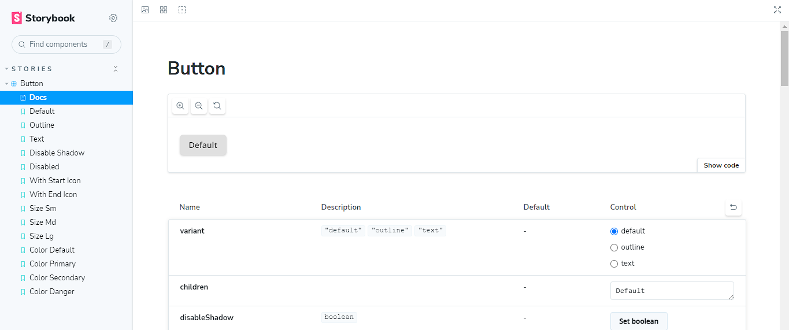

<!-- Please update value in the {}  -->

<h1 align="center">Components DevChallengges</h1>

<div align="center">
   Solution for a challenge from  <a href="http://devchallenges.io" target="_blank">Devchallenges.io</a>.
</div>

<div align="center">
  <h3>
    <a href="https://innate-clouds.surge.sh/">
      Demo
    </a>
    <span> | </span>
    <a href="https://github.com/lemartinezm/components-devchallenges">
      Solution
    </a>
    <span> | </span>
    <a href="https://devchallenges.io/challenges/ohgVTyJCbm5OZyTB2gNY">
      Challenge
    </a>
  </h3>
</div>

<!-- TABLE OF CONTENTS -->

## Table of Contents

- [Table of Contents](#table-of-contents)
- [Overview](#overview)
  - [Built With](#built-with)
- [Features](#features)
- [How To Use](#how-to-use)
- [Acknowledgements](#acknowledgements)
- [Contact](#contact)

<!-- OVERVIEW -->

## Overview



You can see the demo [here](https://innate-clouds.surge.sh/).

### Built With

<!-- This section should list any major frameworks that you built your project using. Here are a few examples.-->

- [React](https://reactjs.org/)
- [SASS](https://sass-lang.com/)
- [Vite](https://vitejs.dev/)
- [TypeScript](https://www.typescriptlang.org/)
- [Storybook](https://storybook.js.org/)

## Features

<!-- List the features of your application or follow the template. Don't share the figma file here :) -->

This application/site was created as a submission to a [DevChallenges](https://devchallenges.io/challenges) challenge. The [challenge](https://devchallenges.io/challenges/ohgVTyJCbm5OZyTB2gNY) was to build an application to complete the given user stories.

## How To Use

```bash
# Clone this repository
$ git clone https://github.com/lemartinezm/components-devchallenges

# Install dependencies
$ npm install

# Run storybook
$ npm run storybook
```

## Acknowledgements

- [How to write stories](https://storybook.js.org/docs/react/writing-stories/introduction)

## Contact

- GitHub [@lemartinezm](https://github.com/lemartinezm)
